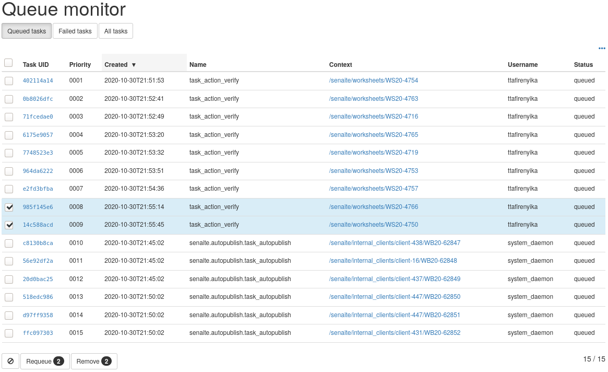

Quickstart
==========

This section gives an introduction about `senaite.queue`_. It assumes you
have `SENAITE LIMS`_ and `senaite.queue` already installed, with a consumer
listening at port 8089, the queue server listening at port 8090 and a regular
zeo client listening at port 8080. Please read the :doc:`installation` for
further details.

.. _QueueControlPanel:

Queue control panel
-------------------

Visit the control panel view for `senaite.queue` to configure the settings.
This control panel is accessible to users with `Site Administrator` role,
through "Site Setup" view, "Add-on Configuration" section:

http://localhost:8080/senaite/@@queue-controlpanel

In most cases, the settings that come by default will fit well. Modifying some
of them might speed-up the processing of queued tasks, but might also increase
the chance of conflicts. Therefore, is strongly recommended to monitor the
instance while modifying this settings:

* **Queue server**: URL of the zeo client that will act as the queue server.
  This is, the zeo client others will rely on regarding tasks addition,
  retrieval and removal. An empty value or a non-reachable queue server disables
  the asynchronous processing of tasks. In such case, system will behave as if
  senaite.queue was not installed.

* **Number of objects to process per task**: This is the default number of
  objects to process in a single request when the task contains multiple items.
  The items from a task are processed in chunks, and remaining are re-queued for
  later. For instance, when a user selects multiple analyses for their
  assignment to a worksheet, only one task is generated. If the value defined is
  5, the analyses will be assigned in chunks of this size, and the system will
  keep generating tasks for the remaining analyses until all them are finally
  assigned. Higher values increment the chance of transaction commit conflicts,
  while lower values tend to slow down the completion of the whole task.
  A value of 0 disables queueing if tasks functionality at all.

* **Maximum retries**: Number of times a task will be re-queued before being
  considered as failed. A value of 0 disables the re-queue of failing tasks.

* **Minimum seconds**: Minimum number of seconds to book per task. If the task
  is performed very rapidly, it will have priority over a transaction done from
  userland. In case of conflict, the transaction from userland will fail and
  will be retried up to 3 times. This setting makes the thread that handles the
  task to take some time to complete, thus preventing threads from userland to
  be delayed or fail.

* **Maximum seconds**: Number of seconds to wait for a task to finish before
  being re-queued or considered as failed. System will keep retrying the task
  until the value set in 'Maximum retries' is reached, at which point the task
  will be eventually considered as failed and no further actions will take place.

* **Auth secret key**: This secret key is used by senaite.queue to generate an
  encrypted token (symmetric encryption) for the authentication of requests sent
  by queue clients and consumers to the Queue's server API. Must be 32 url-safe
  base64-encoded bytes.

Queueing a task
---------------

Login as a SENAITE regular user with "Lab Manager" privileges. Be sure there
are some analyses awaiting for assignment and create a worksheet, either by
manually assigning some analyses or by using a Worksheet Template. As soon as
the worksheet is created, the system displays a viewlet stating that some
analyses have been queued for the current worksheet:

.. image:: static/worksheet_queued_analyses_viewlet.png
  :width: 401
  :alt: Viewlet showing the number of queued analyses in a Worksheet

Keep pressing the "Refresh" button and the message will eventually disappear, as
soon as the reserved client finishes processing the task.

.. note:: If you don't see any change after refreshing the page several times,
          check that you have the consumer client running in background
          and the reserved user is properly configured.

Queue monitoring
----------------

The queue monitoring view is accessible from the top-right "hamburger" menu,
link "Queue Monitor":

http://localhost:8080/senaite/queue_tasks

The failed, running and queued tasks are displayed in this view, along with
their Task Unique Identifiers (TUIDs). From this view, the user can manually
re-queue or remove tasks at a glance:

Failed tasks shouldn't be the norm, but there is always the chance that a task
cannot complete. In order to provide insights about the reason/s behind a
failure, the monitor listing displays also the error trace raised by the system
when trying to process the task.

Queued task details
-------------------

Given a TUID, the user can see the whole information of a given task in JSON
format. The TUID of each task displayed in the Queue Monitoring view explained
above is a link to the full detail of the task:

.. code-block:: javascript

    {
        "status": "queued",
        "context_uid": "67127b454506455f81d69921beec4e93",
        "context_path": "/senaite/worksheets/WS-018",
        "name": "task_action_submit",
        "retries": 5,
        "uids": [
            "bc0c7489fa974e74b68a680568608277",
            "7e6cc0c0de9449ca953dd8b7dfaffb96",
            "2f8f2a05faa14af19545e9f08b4b282c",
            "b2bd04cb1755493186bea52a50f37326",
            "5531c1adc95e47c38ff11c49ff8ff50b",
            "ef19831a8ef9467db401008c1269b937"
        ],
        "created": 1598626797.74663,
        "error_message": null,
        "username": "analyst1",
        "priority": 10,
        "max_seconds": 60,
        "task_uid": "2bb771e4bb7cbcf9625bf761377292d8",
        "action": "submit",
        "min_seconds": 2
    }

The fields displayed might vary depending on the type of task (the "name" field
defines the type of the task). In the example above, the task refers to the
submission (field `action`) of results for 6 analyses from worksheet with id
"WS-018" (field `context_path`). This action has been triggered by the user
with id "analyst1" (field `username`). The field `uids` contains the unique
identifiers of the analyses to be submitted, and the `context_uid` indicates the
unique identifier of the object from which the action/task was triggered.

.. note:: There are plenty of add-ons for browsers that beautify the generated
          JSON, making it's interpretation more comfortable for humans. These
          are some of the plugins you might consider to install in your browser:
          `JSONView for Firefox`_, `JSON Lite for Firefox`_,
          `JSONView for Google Chrome`_

.. Links

.. _senaite.queue: https://pypi.python.org/pypi/senaite.queue
.. _SENAITE LIMS: https://www.senaite.com
.. _JSONView for Firefox: https://addons.mozilla.org/de/firefox/addon/jsonview
.. _JSON Lite for Firefox: https://addons.mozilla.org/en-US/firefox/addon/json-lite
.. _JSONView for Google Chrome: https://chrome.google.com/webstore/detail/jsonview/chklaanhfefbnpoihckbnefhakgolnmc?hl=en
